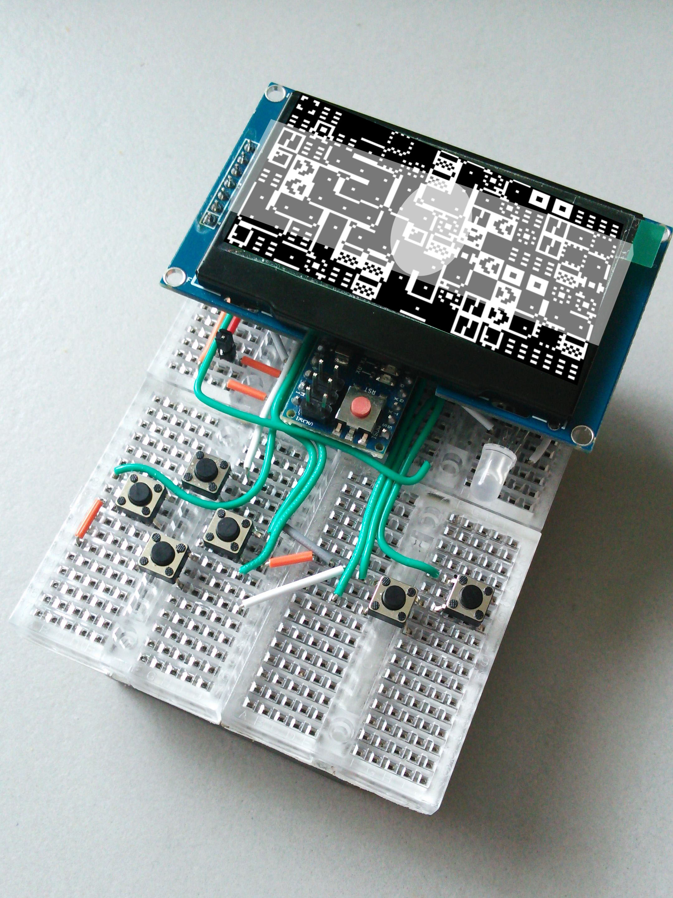

# SourdoughBreadBoy

Fork of the [BreadBoy](https://github.com/MrBlinky/Arduboy-homemade-package#pin-wiring-table) via the [Arduboy Community Forum](https://community.arduboy.com/t/breadboy-a-100-non-soldering-homemade-arduboy/5910) a non-soldering DIY breadboard based arduino gameboy based on the [Arduboy](https://arduboy.com/).

<!-- This [Nano fork](https://github.com/harbaum/Arduboy2) is a starting point. -->

This follows microbiologist, biotechnologist and engineer [Alexandre Benedetto](https://www.lancaster.ac.uk/health-and-medicine/about-us/people/alexandre-benedetto) PDMS fork, for the use of his research and his students at BLS Lancaster of a a technique inspired by an article in [The Worm Breeders Gazette](http://wbg.wormbook.org/2017/07/18/immobilizing-nematodes-for-live-imaging-using-an-agarose-pad-generated-with-a-vinyl-record/)

Think of it as a handheld feminist version of the [ArcadeDeBruno](https://domesticscience.org.uk/criticalkits/InF.html) and a response to [Mikroskopisk PacMan](https://youtu.be/GvZm9EXqrdU)

SourdoughBreadboy is a speculative handheld interspecies gaming platform for a variety of slide based microbiological experiments for learning;

 * Simple protist protest environments
 * Identifying and counting yeast
 * PDMS moulded environments from domestic 'capitalist ruins', ie old electronics and utensils and contribute to a social media based community of moulders

## MET Matrix

[MET Matrix](MET_Matrix.md)

Map out the energy toxicity matrix so we trace the complete carbon cost of your build using the [Materials Energy Toxicity Matrix](http://thingscon2018.productscience.net/) developed at OMGCLIMATE 2019. We found this via [@mrchrisadams](https://twitter.com/mrchrisadams) excellent talk on [Reducing Carbon In the Digital Realm](https://docs.google.com/presentation/d/1_uTPiW5aMCwFhZcpLDxjY-AQMgDmHIyUEZQQ-G6XXq8/edit#slide=id.g5d9e2f62d2_0_42) at [Maintenance Festival 2019 in Liverpool](https://festivalofmaintenance.org.uk)
